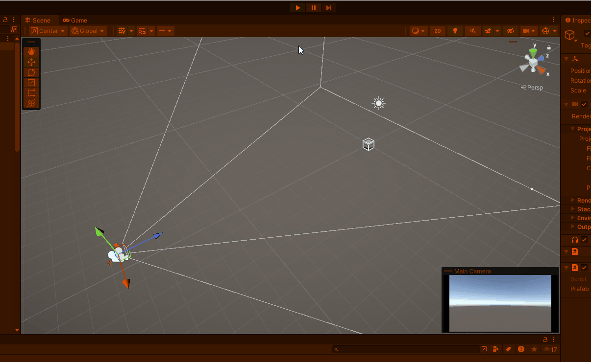

# Opdr 1 Functions, Methods, Parameters & return type
dit heb ik gemaakt een random ball spawner

[script](Assets/Scripts/Ball%20spawner.cs)
# OPDR 2 Class, Object, Constructor & Instantiate
dit is de random tower spawner het is nog steeds niet helemaal gelukt maar ik hoop dat het goed genoeg is

[script](Assets/Scripts/Tower.cs)
[script](Assets/Scripts/Towerspawner.cs)