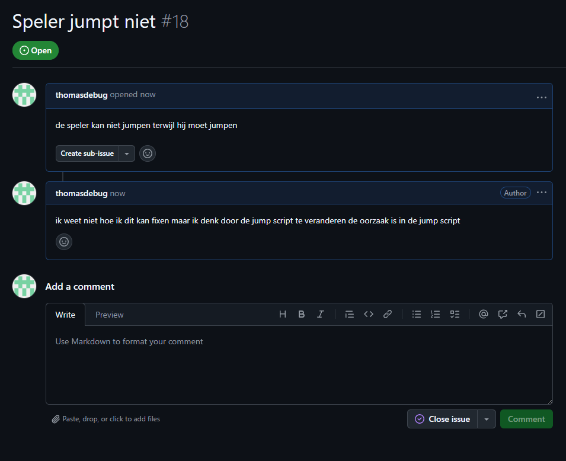
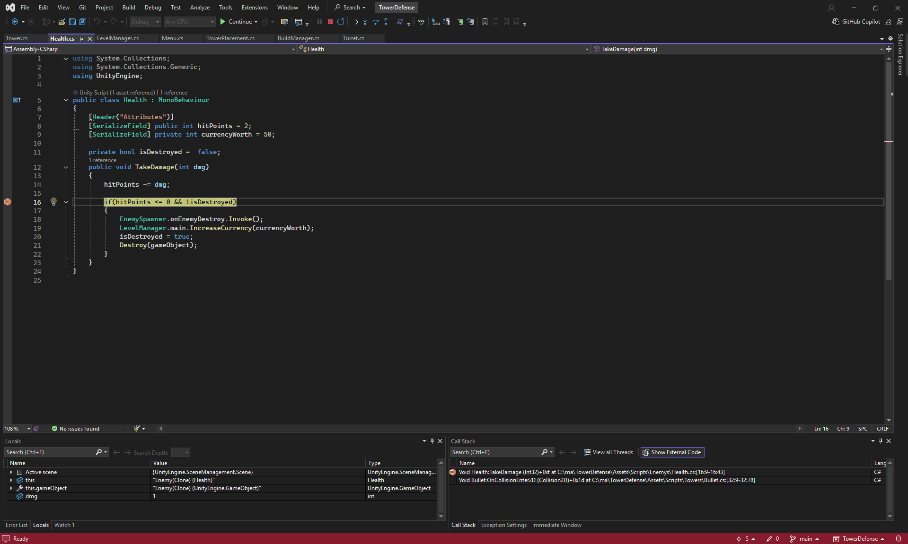
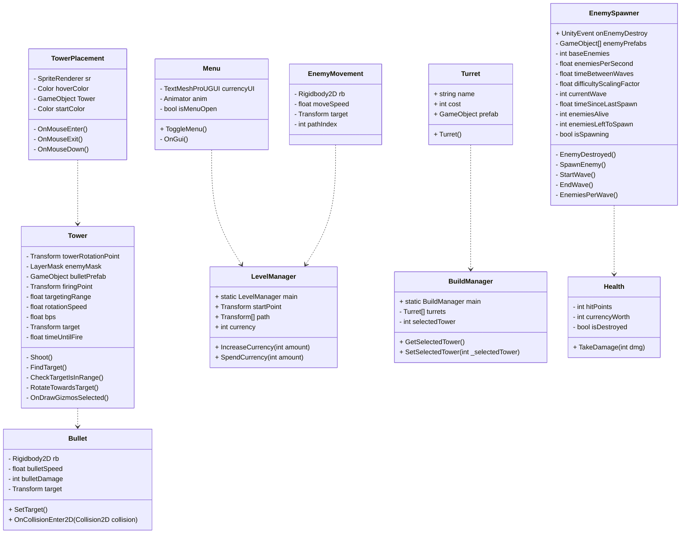

# Opdr 1.1 : Functions, Methods, Parameters & return type
dit heb ik gemaakt een random ball spawner met functions

[script](Assets/Scripts/1-1/Ballspawner.cs)
# OPDR 1.2 : Class, Object, Constructor & Instantiate
dit is de random tower spawner het is nog steeds niet helemaal gelukt maar ik hoop dat het goed genoeg is met classes

[script](Assets/Scripts/1-2/Tower.cs)
[script](Assets/Scripts/1-2/Towerspawner.cs)
# OPDR 1.3 : List en loop
ik heb lists en loops gebruikt om deze enemy spawner te maken
![gif][def]
[Script](Assets/Scripts/1-3/Enemy.cs)
[Script](Assets/Scripts/1-3/EnemySpawner.cs)
# OPDR 2 : Action Events
ik heb met action events dit gemaakt

[script](Assets/Scripts/2/Pickup.cs)
[script](Assets/Scripts/2/PlayerController.cs)
[script](Assets/Scripts/2/Scoreboard.cs)
# OPDR 3A : Wat veroorzaakt de bugs?
1 = de shotrange staat op 0
2 = de player is verkeert gespeeld in de code
# OPDR 3B : Vastleggen van Mythe bugs

# OPDR 3C : Breakpoints

# OPDR 3D : Bijhouden bugs voor Towerdefense
https://github.com/thomasdebug/TowerDefense
# OPDR 4 & 5 : DRY en SRP
hier kan je de code zien en het prototype
https://github.com/thomasdebug/Space48
# OPDR 6 : OOP Inheritance
ik heb deze opdracht niet kunnen afmaken maar hier zijn de scripts waar ik mee bezig was
[script](Assets/Scripts/6/Brute.cs)
[script](Assets/Scripts/6/EnemyParent.cs)
# OPDR 7 : OOP Encapsulation
i had helaas niet elke variable kunnen zetten naar private kunnen zetten en ik was er deze les er niet dus dat is jammer.
https://github.com/thomasdebug/TowerDefense
# M6 : OPDR1 : Code Conventions

# M6 : OPDR2 : Class Diagrams
hier is de link naar de TowerDefense https://github.com/thomasdebug/TowerDefense

# M6 : Data Structures
ik heb hier data structures gebruikt zoals enums, classes en structs

[Script](Assets/Scripts/M6-3/Inventory.cs)
[Script](Assets/Scripts/M6-3/Items.cs)
[Script](Assets/Scripts/M6-3/ItemStats.cs)
[Script](Assets/Scripts/M6-3/ItemType.cs)
[Script](Assets/Scripts/M6-3/ItemsTemplate.cs)
[def]: OPDR1.3.gif